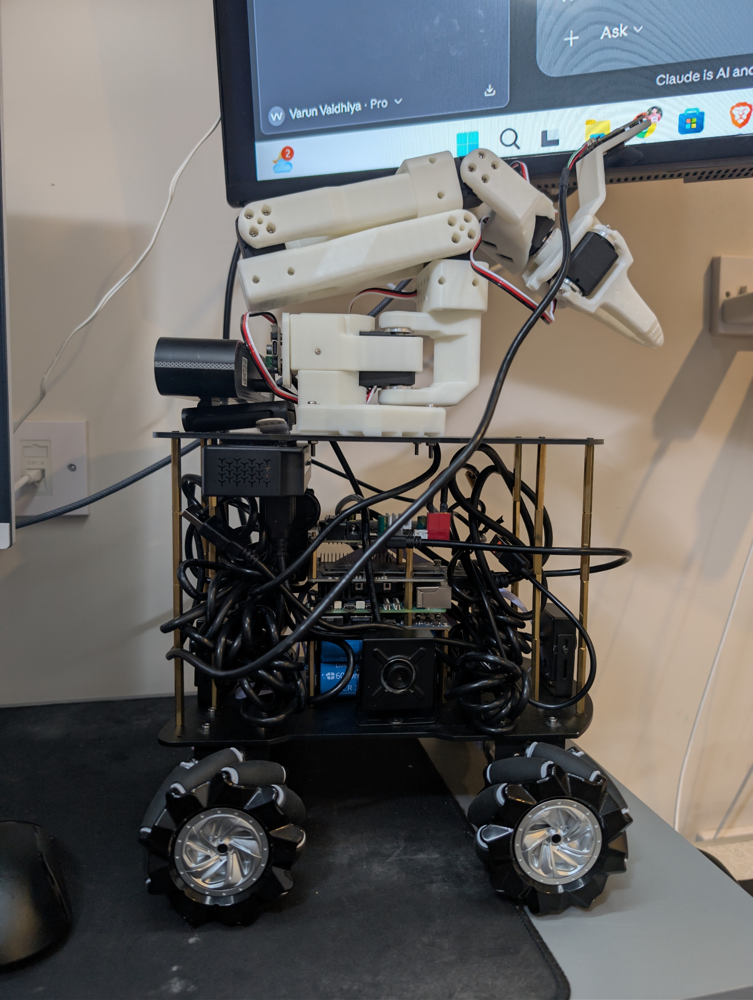
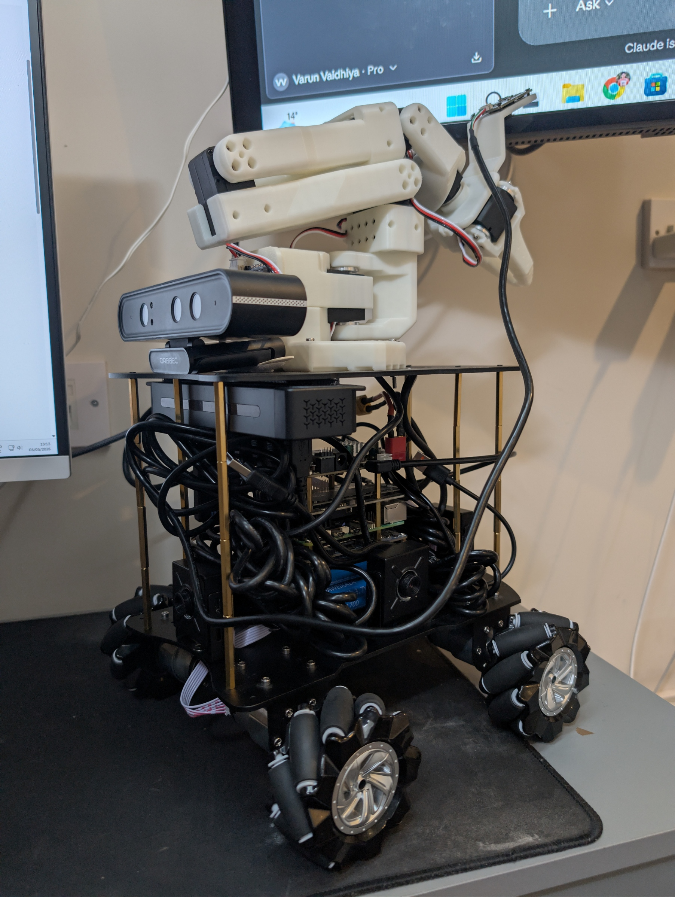

<div align="center">
  <h1>🤖 OmniBot: The OhhO Reference Architecture</h1>
  <p><strong>The official open-source mobile manipulation platform by OhhO Robotics</strong></p>

  <p align="center">
    
    
  </p>

  <p align="center">
    
    
  </p>

  <p align="center">
    <a href="https://www.youtube.com/@varun.vaidhiya/videos">
      
    </a>
    &nbsp;
    <a href="https://x.com/varunvaidhiya">
      
    </a>
    &nbsp;
    
    &nbsp;
    
  </p>
</div>

---

## 🌍 Overview
**OmniBot** is a ROS 2 mecanum-wheel mobile-manipulation robot with embodied AI (OpenVLA / SmolVLA). This repository is the complete **meta-workspace** containing the hardware drivers, ROS 2 nodes, AI engines, digital twins, and client applications.

This repo powers the physical hardware that runs the **OhhO OS**.

### 🌟 Key Features
*   **Embodied AI:** Natively runs OpenVLA and SmolVLA for high-level semantic navigation and visual-language-action tasks.
*   **Teleoperation & Data Collection:** Built-in tools for leader-follower arm teleoperation to record episodes in HuggingFace LeRobot format.
*   **Real-time Perception:** 4-camera stitched Bird's-Eye-View (BEV) mapping and Live MJPEG camera feeds.
*   **Cross-Platform Clients:** Control the robot via an Android app, Xbox Controller, or a Meta Quest 3 VR headset.

---

## 📂 Repository Structure
This repository contains the complete OhhO ecosystem split into modular packages:

| Directory | Purpose |
|---|---|
| `omnibot-ros2/` | Foundational ROS 2 Jazzy workspace (navigation, SLAM, kinematics, arm control). |
| `omnibot-ai-ros2/` | ROS 2 wrappers linking physical hardware to AI foundation models (VLA, LeRobot, RL). |
| `omnibot-ai-engines/` | Pure Python/FastAPI backend servers for training and inference. |
| `omnibot-digital-twin/` | High-fidelity Gazebo and Isaac Sim simulation environments. |
| `yahboom-python-driver/` | Pure-Python protocol encoder/decoder for Yahboom boards. |
| `ros2-bev-stitcher/` | Real-time Bird's-Eye View camera stitching. |
| `mecanum-kinematics/` | Modular math library for omnidirectional drives. |
| `omnibot-android/` | Kotlin MVVM Android controller app (via ROSBridge). |
| `omnibot-vr/` | Unity Quest 3 mixed-reality teleop app. |

---

## 🛠️ Hardware BOM (Bill of Materials)
To build your own OmniBot, you will need:
- Yahboom ROS Robot Expansion Board (mecanum drive, USB serial)
- 4× mecanum wheels (40 mm radius)
- **Raspberry Pi 5 (8 GB)** — The core robot brain
- **SO-101 6-DOF arm** with 7× Feetech STS3215 servos (LeRobot compatible)
- 5× USB cameras (4 base-mounted + 1 wrist)
- Orbbec Astra Pro RGB-D camera (optional — depth + 3D point cloud)
- Xbox controller (for teleoperation)

*Full BOM and assembly instructions can be found in the personal developer repo or `omnibot-ros2` docs.*

---

## 🚀 Quick Start (Physical Robot)

### 1. Prerequisites
- Ubuntu 24.04 + ROS 2 Jazzy on the Raspberry Pi 5.
- Python 3.10+
- `lerobot` installed for data collection (`pip install lerobot`)

### 2. Build the Core ROS 2 Workspace
```bash
cd omnibot-ros2
source /opt/ros/jazzy/setup.bash
rosdep install --from-paths src --ignore-src -y
colcon build --symlink-install
source install/setup.bash
```

### 3. Launch Teleoperation (Xbox)
```bash
# Robot driver + Xbox controller (all-in-one)
ros2 launch omnibot_bringup robot_with_joy.launch.py
```
*   **Hold RB:** Enable driving
*   **Hold RT:** Turbo (2× speed)
*   **Left stick:** Linear X / Y (strafe)
*   **Right stick:** Rotate (angular Z)

### 4. Launch Perception & Cameras
```bash
# Start all cameras and BEV stitcher (run on Pi):
ros2 launch omnibot_bringup perception.launch.py
```

### 5. Launch the Android App
```bash
# Start ROSBridge WebSocket server (port 9090)
ros2 launch rosbridge_server rosbridge_websocket_launch.xml port:=9090
```
Open the Android app -> Settings -> enter your robot's IP address (e.g., `192.168.1.100`) -> Connect.

---

## 🧠 LeRobot Data Collection
Use `teleop_recorder_node` to record leader-follower demonstrations in [LeRobot HuggingFace dataset format](https://github.com/huggingface/lerobot).

```bash
# 1. Start cameras and BEV stitcher
ros2 launch omnibot_bringup perception.launch.py

# 2. Start arm driver (follower arm on /dev/ttyACM0, leader on /dev/ttyACM1)
ros2 launch omnibot_arm arm.launch.py

# 3. Start the recorder
ros2 launch omnibot_lerobot teleop_record.launch.py
```

*   **Press RB** on the Xbox controller to start/stop recording an episode.
*   **Press LB** to discard a bad episode.

Episodes auto-save. You can then push them directly to Hugging Face Hub using the `lerobot` CLI.

---

## 🌐 Multi-Machine Networking
For heavy AI workloads, inference runs on a local GPU workstation while the Pi handles real-time control.
Edit your network environment file:
```bash
WORKSTATION_IP=192.168.1.100   # Desktop / VLA Inference PC
PI_IP=192.168.1.101            # Raspberry Pi 5
```
Ensure `ROS_DOMAIN_ID` is identical across all machines.

---

## 🤝 Contributing & License
Contributions are welcome for hardware docs, new teleoperation methods (SpaceMouse, Web UI), and camera calibration.

**License:** Apache 2.0
