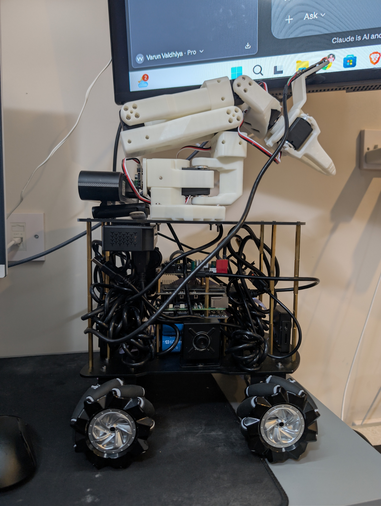
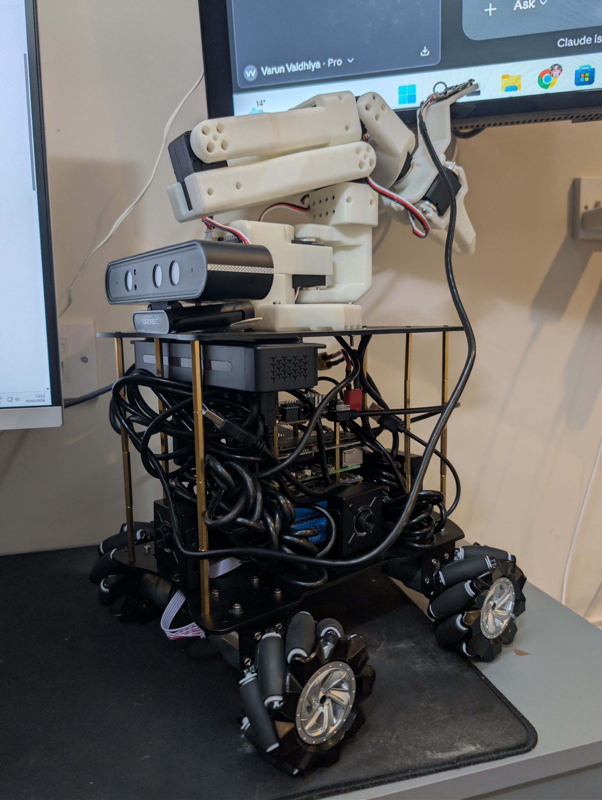
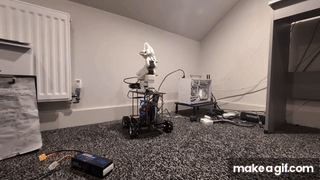
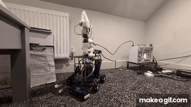

<div align="center">
  <h1>🤖 OmniBot: The OhhO Reference Architecture</h1>
  <p><strong>The official open-source mobile manipulation platform by OhhO Robotics</strong></p>

  <p align="center">
    
    
  </p>

  <p align="center">
    
    
  </p>

  <p align="center">
    <a href="https://www.youtube.com/@varun.vaidhiya/videos">
      
    </a>
    &nbsp;
    <a href="https://x.com/varunvaidhiya">
      
    </a>
    &nbsp;
    <a href="https://github.com/ohho-robotics/OmniBot/actions/workflows/ci.yml"></a>
    &nbsp;
    
    &nbsp;
    <a href="LICENSE"></a>
  </p>
</div>

OmniBot is OhhO Robotics' mecanum-wheel mobile manipulator. This repository holds the ROS 2 packages linked from [`src/`](src/), the [wheel kinematics](mecanum-kinematics/), the [Yahboom board protocol](yahboom-python-driver/), the [Quest project](omnibot-vr/), and the [Android app](omnibot-android/). The photos and GIFs above are the files in [`assets/`](assets/).

## CPU-only demo

No robot and no GPU. [`ohho-os` 1.1.2](https://pypi.org/project/ohho-os/1.1.2/) is on PyPI under [Apache-2.0](https://github.com/ohho-robotics/ohho-sdk/blob/main/LICENSE). `ohho doctor` and `ohho sim` are implemented in [`ohho/cli.py`](https://github.com/ohho-robotics/ohho-sdk/blob/main/ohho/cli.py); the sim adapter is [`ohho/adapters/sim.py`](https://github.com/ohho-robotics/ohho-sdk/blob/main/ohho/adapters/sim.py). The docs-test job in [`.github/workflows/ci.yml`](.github/workflows/ci.yml) runs these three commands in a fresh virtualenv via [`scripts/docs_test_readme.py`](scripts/docs_test_readme.py).

<!-- docs-test: cpu -->
```bash
pip install ohho-os
ohho doctor
ohho sim --robot omnibot --seconds 2
```

## ROS 2 path

Ubuntu 24.04 with ROS 2 Jazzy already installed. The symlinks in [`src/`](src/) are the colcon workspace. The `ros` job in [`.github/workflows/ci.yml`](.github/workflows/ci.yml) runs this block on `ros:jazzy-ros-base-noble`. The docs-test job skips it.

<!-- docs-test: skip ros -->
```bash
sudo apt-get update
sudo apt-get install -y python3-colcon-common-extensions python3-rosdep python3-pytest
sudo rosdep init || true
rosdep update
source /opt/ros/jazzy/setup.bash
rosdep install --from-paths src --ignore-src -y --rosdistro jazzy \
  --dependency-types=build \
  --dependency-types=buildtool \
  --dependency-types=build_export \
  --dependency-types=buildtool_export \
  --dependency-types=exec \
  --dependency-types=test
colcon build --symlink-install --base-paths src
source install/setup.bash
colcon test --base-paths src --event-handlers console_direct+ --return-code-on-test-failure
colcon test-result --verbose
```

## Needs hardware / needs GPU

| Feature | Needs | Evidence |
|---|---|---|
| `ohho sim --robot omnibot` | Neither | [ohho-os 1.1.2](https://pypi.org/project/ohho-os/1.1.2/) and the docs-test job in [ci.yml](.github/workflows/ci.yml) |
| Colcon build and test of `src/` | Neither | [src/](src/) and the `ros` job in [ci.yml](.github/workflows/ci.yml). That job needs ROS 2 Jazzy. |
| Kinematics, Yahboom codec, BEV homography, arm tick math, learning engine, agent engine | Neither | The `cpu` job in [ci.yml](.github/workflows/ci.yml) |
| Xbox teleop, cameras, arm, LeRobot recording | Robot | [robot_with_joy.launch.py](omnibot-ros2/omnibot_bringup/launch/robot_with_joy.launch.py), [perception.launch.py](omnibot-ros2/omnibot_bringup/launch/perception.launch.py), [arm.launch.py](omnibot-ros2/omnibot_arm/launch/arm.launch.py), [teleop_record.launch.py](omnibot-ai-ros2/omnibot_lerobot/launch/teleop_record.launch.py) |
| Nav2 and SLAM | Robot | [omnibot_navigation](omnibot-ros2/omnibot_navigation/) |
| Gazebo compose files | Neither | [docker-compose.yml](omnibot-digital-twin/docker/docker-compose.yml) runs headless Gazebo. [docker-compose.gpu.yml](omnibot-digital-twin/docker/docker-compose.gpu.yml) is an optional NVIDIA overlay. The docs-test job does not start compose. |
| OpenVLA / SmolVLA weights | GPU | [vla_engine/README.md](omnibot-ai-engines/vla_engine/README.md) and [requirements.txt](omnibot-ai-engines/vla_engine/requirements.txt) (`torch`) |
| Isaac Lab RL | GPU | [rl_engine/README.md](omnibot-ai-engines/rl_engine/README.md) and [requirements.txt](omnibot-ai-engines/rl_engine/requirements.txt) (`isaaclab`, `onnxruntime-gpu`) |
| Android controller | Robot | [omnibot-android/](omnibot-android/). Building it needs the Android SDK and JDK 17 ([`build.gradle.kts`](omnibot-android/build.gradle.kts)), which is separate from a desktop GPU. |
| Quest teleop | Robot | [omnibot-vr/](omnibot-vr/). Unity **6000.5.2f1** is pinned in [`ProjectSettings/ProjectVersion.txt`](omnibot-vr/ProjectSettings/ProjectVersion.txt). |

The launch files below target the physical robot. Docs-test skips them.

<!-- docs-test: skip hardware -->
```bash
ros2 launch omnibot_bringup robot_with_joy.launch.py
ros2 launch omnibot_bringup perception.launch.py
ros2 launch omnibot_arm arm.launch.py
ros2 launch omnibot_lerobot teleop_record.launch.py
```

The requirement files below pull GPU stacks. Docs-test skips them.

<!-- docs-test: skip gpu -->
```bash
pip install -r omnibot-ai-engines/vla_engine/requirements.txt
pip install -r omnibot-ai-engines/rl_engine/requirements.txt
```

## Layout

| Directory | What it is |
|---|---|
| [`src/`](src/) | Colcon workspace (symlinks) |
| [`omnibot-ros2/`](omnibot-ros2/) | Driver, arm, description, bringup, Nav2 |
| [`omnibot-ai-ros2/`](omnibot-ai-ros2/) | VLA, LeRobot, RL, and orchestration nodes |
| [`omnibot-ai-engines/`](omnibot-ai-engines/) | Learning and agent engines, plus the GPU training trees |
| [`mecanum-kinematics/`](mecanum-kinematics/) | Wheel inverse and forward kinematics |
| [`yahboom-python-driver/`](yahboom-python-driver/) | Yahboom serial protocol |
| [`ros2-bev-stitcher/`](ros2-bev-stitcher/) | Bird's-eye homography |
| [`omnibot-digital-twin/`](omnibot-digital-twin/) | Gazebo world and compose files |
| [`omnibot-android/`](omnibot-android/) | Kotlin controller |
| [`omnibot-vr/`](omnibot-vr/) | Unity Quest project |

## License

[Apache-2.0](LICENSE) for OhhO code in this repository. Vendored Meta XR SDK and CoplayDev unity-mcp packages keep their own licences. See [NOTICE](NOTICE).
